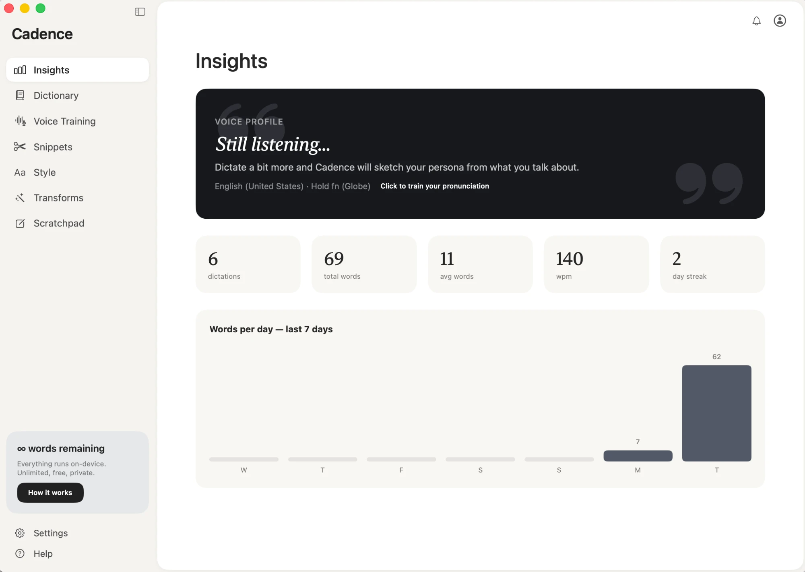

# Cadence 🎙️

**Private, unlimited voice dictation for macOS — 100% on-device.**

Hold `fn`, speak, release — clean text appears at your cursor in any app.
No cloud, no subscription, no word limits. Your audio and transcripts never
leave your Mac.



Cadence is an open-source, fully local take on the modern AI dictation app
(in the spirit of Wispr Flow), built natively in Swift on Apple's on-device
speech and language models, with an optional local Whisper engine.

## Features

- **Push-to-talk dictation** — hold `fn` (or right ⌥) anywhere; release to
  paste at your cursor. Double-tap for hands-free mode.
- **Two recognition engines**, both offline:
  - **Apple** — instant, built into macOS (SpeechAnalyzer, macOS 26).
  - **Whisper** — optional precision engine via
    [WhisperKit](https://github.com/argmaxinc/WhisperKit) (CoreML on the
    Neural Engine). Your vocabulary is fed into the decoder prompt.
- **Self-correct mid-sentence** — slip up? Say "scratch that," "never mind,"
  "strike that," or "back up" and everything since the start of that
  sentence is erased — no need to release the dictation key and start over.
- **Pinpoint corrections** — for a quick fix to a time, date, day, or amount,
  just correct it in place: *"the meeting's at 3pm — actually let's do 4pm"*
  becomes *"the meeting's at 4pm,"* leaving the rest of the sentence intact.
- **Undo the last paste** — hold the dictation key again and say only
  "scratch that" (or "never mind," "go back") with nothing else, and Cadence
  undoes the previous paste, like ⌘Z.
- **Pronunciation learning** — a Voice Training page learns how *you* say
  tricky words; corrections you make to transcripts are diffed and learned
  automatically; everything biases future recognition.
- **Cleanup pipeline** — filler-word removal, spoken "new line"/"new
  paragraph", auto-capitalization, personal dictionary, snippets
  (say a trigger phrase → paste a saved block).
- **Styles** — per-app tone rewriting (formal / casual / very casual) using
  Apple Intelligence's on-device model.
- **Transforms** — select text in any app, press ⌥1 to polish grammar or ⌥2
  to turn rough notes into a structured AI prompt, rewritten in place.
- **Insights** — your Voice Profile persona (derived locally from what you
  dictate), usage stats (dictations, total words, avg words, WPM, day
  streak), and a 7-day words-per-day chart.
- **Launch at Login** — optional toggle in Settings so the dictation key is
  always ready.
- **Scratchpad** — a place to park dictated text that autosaves, without
  pasting into another app.

## Requirements

- macOS 26 (Tahoe) or newer
- Apple Silicon Mac
- Xcode 26 command-line tools (`xcode-select --install`)
- For Styles / Transforms / Voice Profile: Apple Intelligence enabled
- For the Whisper engine: a one-time model download (150 MB – 1.6 GB)

## Build & run

```bash
git clone <this-repo>
cd cadence
./scripts/make_app.sh     # builds build/Cadence.app
open build/Cadence.app
```

Optional: run `./scripts/make_signing_cert.sh` once to create a local
self-signed signing certificate — this keeps macOS permission grants valid
across rebuilds. Without it the app is ad-hoc signed and you'll need to
re-grant Accessibility after each rebuild.

### One-time permissions

1. **Microphone** — allow when prompted on first dictation.
2. **Accessibility** — allow when prompted (needed for the global hotkey and
   for pasting). If the app still shows it as missing, use *Settings →
   Reset Grant & Relaunch* inside Cadence.

## CLI test modes

```bash
.build/debug/Cadence --selftest  # formatter + learning tests
```

## Privacy

Everything runs on this Mac: recognition (Apple SpeechAnalyzer or local
Whisper), cleanup, tone rewriting (Apple Intelligence), and the Voice
Profile analysis. Cadence makes no network requests except the one-time
model downloads by macOS itself (Apple speech assets) and, if you opt into
the Whisper engine, the model fetch from Hugging Face. Dictation data is
stored only in `~/Library/Application Support/Cadence/`.

## Architecture

Swift Package, one third-party dependency (WhisperKit, only if you use the
Whisper engine):

```
HotkeyMonitor  →  AudioRecorder  →  Transcriber (Apple) / WhisperEngine
                                        ↓
  TextFormatter (self-corrections, fillers, spoken commands, dictionary)
                                        ↓
        LearnedStore → SnippetStore → RewriteEngine (Styles)
                                        ↓
              TextInserter (clipboard + ⌘V) — or undone via
              RecordingIndicator when the whole dictation was
              just a cancel phrase
```

`TextFormatter` is where the self-correction logic lives: a "pinpoint
correction" pass (retargets a spoken time/date/day/amount) runs first,
then a "cancel phrase" pass (erases back to the start of the sentence),
before the usual filler-removal and cleanup rules.

See [PLAN.md](PLAN.md) for the original design document.

## License

[MIT](LICENSE). Not affiliated with Wispr Flow, OpenAI, or Apple.
